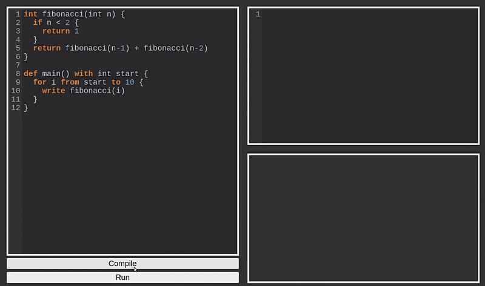

# Simple Procedural Language to WASM Compiler

A compiler paired up with a web app IDE, developed as an engineer's thesis project. Allows to create code in a simple procedural language and see its compiled WebAssembly (WASM) code, which can then be run from inside the user's browser.

WebAssembly is a relatively new element of the web platform -- a compilation target designed to perform computationally complex operations inside a web browser. You can learn more about it [here](https://webassembly.org/).

The compiler was created as my engineer's thesis project in 2021.

<p align="center">

</p>

## App features

- Code editor with some simple quality of life improvements, such as syntax highlighting, auto bracket closing, and auto indenting
- A preview of the compiled WASM code
- A console window, tracking the program's inputs and outputs
- Quite complex error highlighting

## Language features

The source language was designed specifically for this project, with the aim of being syntactically simple, but functional enough to be able to implement even more complex algorithms. The syntax was loosely based on Python, with some Golang elements. The features include:

- Integer and floating point variables
- Arithmetical operations of addition, subtraction, multiplication, and division
- Array data structure (only as global variables)
- Conditional blocks and loops
- Input/output operations
- Functions and procedures, with recursive calls, parameters, and local variables

### Code example

A classic quick sort algorithm implementation in the source language:
```python
arrays int A[8]

int partition(int l, int r) with int x, int i, int temp {
  x = A[r]
  i = l - 1
  for j from l to r-1 {
    if A[j] <= x {
      i = i + 1
      temp = A[j]
      A[j] = A[i]
      A[i] = temp
    }
  }
  i = i + 1
  temp = A[r]
  A[r] = A[i]
  A[i] = temp
  return i
}

def quick_sort(int l, int r) with int q {
  if l < r {
    q = partition(l, r)
    quick_sort(l, q-1)
    quick_sort(q+1, r)
  }
}
```

## Installing

With Python 3.10 installed, you can create a venv and run

```bash
pip install -r requirements.txt
```

The app can then be run using
```bash
python -m flask --app app.py run
```

The command's output will then specify the localhost address that can be used to access the app from the browser.

